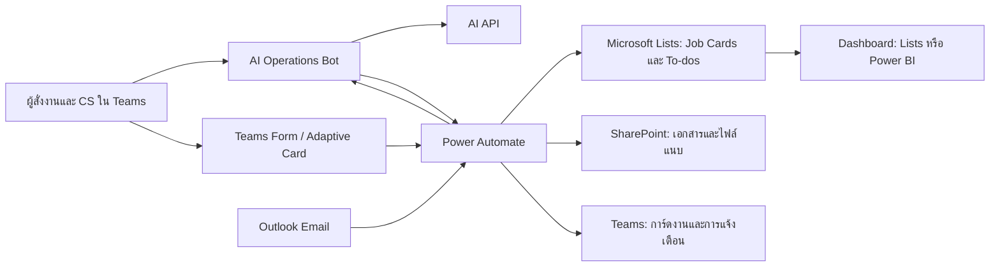

# เอกสารออกแบบ: Teams-first Freight Operations Planner พร้อม AI Bot

## 1. ภาพรวม

โครงการนี้คือระบบจัดการงานสำหรับทีม Freight Forwarder และ Customer Service (CS) ที่ใช้ Microsoft Teams เป็นช่องทางปฏิบัติงานหลัก โดยมี Microsoft Lists เป็นฐานข้อมูลกลาง และ Power Automate เป็นระบบ workflow/แจ้งเตือน

เพิ่ม **AI Operations Bot** ใน Teams เพื่อช่วยสรุป คัดกรอง และเสนอการอัปเดตข้อมูลจากข้อความหรืออีเมล โดยให้พนักงานยืนยันก่อนมีการเปลี่ยนแปลงข้อมูลสำคัญทุกครั้ง

## 2. เป้าหมาย

- ให้ผู้สั่งงานและทีม CS ทำงานส่วนใหญ่ได้จาก Microsoft Teams
- จัดเก็บงานต่อ booking หรือ shipment ใน Job Card กลาง
- เห็นเจ้าของงาน, งานคงค้าง, deadline และ workload ได้ชัดเจน
- ลดเวลาที่ใช้ในการอ่านอีเมลและกรอกข้อมูลซ้ำ
- ใช้ AI เพื่อช่วยสรุป/เสนอข้อมูล ไม่ใช่ตัดสินใจหรือแก้ไขข้อมูลสำคัญเอง

## 3. สถาปัตยกรรมที่เสนอ

### องค์ประกอบ

| องค์ประกอบ | หน้าที่ |
| --- | --- |
| Microsoft Teams | จุดที่ผู้ใช้และ CS สั่งงาน ตอบกลับ และอัปเดตงาน |
| AI Operations Bot | เข้าใจคำถาม/คำสั่ง, สรุปข้อมูล, และส่งข้อเสนอให้ยืนยัน |
| Power Automate | เชื่อม workflow, สร้างการ์ด, แจ้งเตือน deadline, และเขียนข้อมูล |
| Microsoft Lists | เก็บ Job Card, To-do, สถานะ, owner, deadline และประวัติ |
| SharePoint | เก็บเอกสารและไฟล์แนบที่เกี่ยวกับ Job Card |
| Outlook | จุดรับอีเมล booking หรือเอกสารจากลูกค้า |
| Dashboard | หน้าใหัหัวหน้าดู workload, งานเสี่ยง และ SLA |

## 4. หลักการออกแบบ

1. **Teams เป็นหน้าหลัก** — งานประจำต้องทำได้จากแชตและการ์ด ไม่บังคับให้ CS เปิด Dashboard
2. **Lists เป็นแหล่งข้อมูลจริง** — ข้อความในแชตเป็นคำสั่งหรือการสนทนา แต่ข้อมูลงานจริงอยู่ใน Job Card
3. **AI ต้องเสนอ ไม่สั่งการเอง** — การสร้าง/แก้ไขข้อมูลสำคัญต้องแสดงสรุปให้คนกดยืนยัน
4. **Job Card หนึ่งใบต่อหนึ่ง booking/shipment** — ทุกข้อมูล เอกสาร งานย่อย และประวัติอยู่รวมกัน
5. **แจ้งเตือนเท่าที่ต้องทำ** — ลดการแจ้งเตือนถี่เกินไปด้วยสรุปรายวันและกติกา escalation

## 5. บทบาทผู้ใช้

| บทบาท | สิทธิ์หลัก |
| --- | --- |
| ผู้สั่งงาน | สร้างงาน ส่งรายละเอียด เพิ่มโน้ต ติดตามสถานะ |
| CS เจ้าของงาน | รับงาน อัปเดตสถานะ ทำ To-do เพิ่มโน้ต/เอกสาร |
| CS ผู้ช่วย | ทำงานย่อยและอัปเดตข้อมูลใน Job Card ที่ได้รับมอบหมาย |
| หัวหน้าทีม | มอบหมาย/โยกงาน ดู workload ตรวจงานค้าง และรับ escalation |
| ผู้ดูแลระบบ | ตั้งค่า template, สถานะ, สิทธิ์, flow และ AI policy |

## 6. โครงสร้างข้อมูล

### 6.1 Job Card

| ฟิลด์ | ตัวอย่าง |
| --- | --- |
| Job ID | JOB-2026-0001 |
| ลูกค้า | Customer A |
| Booking number | BK-12345 |
| ประเภท shipment | Export Sea / Import Sea / Air Freight |
| เส้นทาง | Bangkok → Singapore |
| สายเรือ/สายการบิน | ระบุเมื่อทราบ |
| Owner | CS หลัก |
| Backup/Assistant | CS ผู้ช่วย |
| สถานะ | New, In Progress, Waiting Customer, Blocked, Completed |
| Priority | Normal, High, Critical |
| Cut-off / Deadline | วันที่และเวลา |
| ETA / ETD | วันที่และเวลา |
| สรุปล่าสุด | ข้อความสั้นที่อัปเดตล่าสุด |
| ลิงก์เอกสาร | SharePoint folder |

### 6.2 To-do

| ฟิลด์ | ตัวอย่าง |
| --- | --- |
| Job ID | เชื่อมกับ Job Card |
| ชื่องาน | ตรวจ Shipping Instruction |
| ผู้รับผิดชอบ | CS เจ้าของงานหรือผู้ช่วย |
| สถานะ | Not Started / Doing / Waiting / Done |
| Deadline | วันที่และเวลา |
| แหล่งที่มา | Template / มอบหมาย / AI draft |

### 6.3 Activity Log

เก็บผู้ดำเนินการ เวลา เหตุการณ์ ค่าเดิม/ค่าใหม่ และลิงก์ข้อความหรือเอกสารที่เกี่ยวข้อง เพื่อใช้ตรวจสอบย้อนหลัง

## 7. ประสบการณ์ใช้งานใน Teams

### 7.1 ผู้สั่งงาน

ผู้ใช้พิมพ์หรือ @mention บอต เช่น:

> `@OperationsBot สร้างงาน Booking ลูกค้า A ส่งออกสิงคโปร์ มอบหมาย CS เอ ต้องส่ง SI ภายในพรุ่งนี้บ่ายสาม`

บอตจะ:

1. ดึงข้อมูลเป็นโครงสร้าง
2. สร้างการ์ดสรุป เช่น ลูกค้า, booking, owner, deadline, งานย่อย
3. ให้ผู้สั่งงานกด **ยืนยัน**, **แก้ไข**, หรือ **ยกเลิก**
4. หลังยืนยัน จึงสร้าง Job Card และส่งการ์ดงานถึง CS

### 7.2 CS รับและอัปเดตงาน

การ์ดงานของ CS ควรมีปุ่ม:

- รับงาน
- เริ่มดำเนินการ
- รอลูกค้า / รอเอกสาร
- เพิ่มอัปเดต
- เพิ่ม To-do
- ขอความช่วยเหลือ
- ขอเลื่อน deadline
- ปิดงาน

เมื่อกดปุ่ม “เพิ่มอัปเดต” ให้เปิดฟอร์มสั้นสำหรับกรอกสถานะ, เลข booking, ETD/ETA, หมายเหตุ และไฟล์แนบ

### 7.3 หัวหน้าทีม

ตัวอย่างคำถาม:

> `@OperationsBot สรุปงานใกล้ cut-off วันนี้`

> `@OperationsBot ใครมีงานค้างมากที่สุด`

บอตตอบด้วยสรุปที่ดึงจาก Lists และลิงก์ไปยังมุมมอง Dashboard ที่เกี่ยวข้อง

## 8. ความสามารถของ AI Operations Bot

### ระยะเริ่มต้น

- สรุปข้อความและอีเมลให้เป็นภาษาอ่านง่าย
- แยกข้อมูลสำคัญ: ลูกค้า, booking, shipment type, deadline, ETA/ETD และสิ่งที่ต้องดำเนินการ
- ร่าง Job Card, โน้ต หรือ To-do จากข้อความ
- สรุปสถานะงานรายวัน/รายสัปดาห์
- ตอบคำถามจากข้อมูล Job Card ที่ผู้ใช้มีสิทธิ์เข้าถึง

### ระยะต่อไป

- จับคู่อีเมลใหม่กับ Job Card เดิม
- ตรวจจับ deadline หรือ cut-off ที่ขาดหาย
- แจ้งงานที่มีความเสี่ยงล่วงหน้า
- เสนอ CS ที่เหมาะสมตาม workload และทักษะ
- สรุป thread การสนทนาหรือ handover ระหว่างกะ

## 9. กติกาความปลอดภัยและการยืนยัน

AI ทำได้โดยไม่ต้องขออนุมัติสำหรับ:

- สรุปข้อความ/อีเมล
- คัดแยกข้อมูลเป็นร่าง
- ตอบคำถามหรือดึงรายงานตามสิทธิ์

AI ต้องขอการยืนยันก่อน:

- สร้าง Job Card ใหม่
- เปลี่ยน owner หรือ deadline
- ปิด Job Card หรือ To-do สำคัญ
- ส่งข้อความแจ้งลูกค้าหรือผู้เกี่ยวข้องภายนอก
- ลบข้อมูลหรือเอกสาร

ข้อมูลควรส่งเข้า AI เท่าที่จำเป็น และต้องกำหนดสิทธิ์ให้บอตอ่านเฉพาะทีม/รายการที่ผู้ใช้เข้าถึงได้

## 10. Workflow ที่ควรสร้างด้วย Power Automate

### Flow A: สร้างงานจาก Teams

1. ผู้ใช้ส่งคำสั่งหรือกรอกฟอร์มใน Teams
2. AI แยกข้อมูลและสร้างการ์ดร่าง
3. ผู้ใช้ยืนยัน
4. Flow สร้าง Job Card และ To-do ตาม template
5. Flow ส่งการ์ดแจ้งงานให้ CS เจ้าของงาน

### Flow B: CS อัปเดตงาน

1. CS กดปุ่มหรือกรอก Adaptive Card
2. Flow อัปเดต Job Card/To-do ใน Lists
3. Flow บันทึก Activity Log
4. Flow แจ้งผู้เกี่ยวข้องเฉพาะเมื่อข้อมูลสำคัญเปลี่ยน

### Flow C: รับอีเมลเข้า

1. อีเมลเข้า shared mailbox หรือกล่องกลาง
2. Flow เก็บไฟล์แนบใน SharePoint
3. AI สรุป/ดึงข้อมูล และเสนอจับคู่ Job Card
4. CS ยืนยันว่าเป็น Job Card เดิมหรือสร้างใหม่
5. Flow บันทึกโน้ต, เอกสาร และ To-do ร่าง

### Flow D: Deadline และ escalation

1. Flow ตรวจงานที่ใกล้ deadline ตามรอบเวลา
2. ส่งเตือน CS เจ้าของงาน
3. หากยังไม่อัปเดตตามกติกา ส่ง escalation ถึงหัวหน้าทีม
4. ส่งรายงานงานเสี่ยงประจำวัน

## 11. Template ตามประเภท Shipment

เริ่มจาก 3 Template:

| Template | To-do ตัวอย่าง |
| --- | --- |
| Export Sea | ตรวจ booking, ยืนยันเรือ, รับเอกสาร, ส่ง SI, ตรวจ draft B/L, ติดตาม cut-off |
| Import Sea | รับ arrival notice, ตรวจเอกสาร, ประสานเคลียร์สินค้า, แจ้งลูกค้า |
| Air Freight | ยืนยัน flight, ตรวจ AWB, ติดตาม cargo cut-off, แจ้ง ETA |

Template กำหนดสถานะ เอกสารที่ต้องใช้ และงานย่อยมาตรฐาน เพื่อให้เปิด Job Card ได้เร็วและลดขั้นตอนตกหล่น

## 12. Dashboard และรายงาน

เริ่มต้นด้วย Microsoft Lists views ก่อน แล้วค่อยเพิ่ม Power BI เมื่อมีข้อมูลมากพอ

มุมมองที่ควรมี:

- งานของฉัน
- งานของทีม แยกตาม CS
- งานใกล้ cut-off / deadline
- งานค้างเกินกำหนด
- งานที่รอลูกค้า/รอเอกสาร
- Workload รายคน
- SLA และ bottleneck ตามประเภท shipment

## 13. แผนทำ MVP

### สัปดาห์ 1: ออกแบบข้อมูลและการทำงาน

- ตกลงสถานะ, deadline, template และกติกาจ่ายงาน
- สร้าง Microsoft Lists สำหรับ Job Card, To-do และ Activity Log
- สร้าง Teams team/channel สำหรับการทดสอบ

### สัปดาห์ 2: Workflow พื้นฐาน

- ทำ Flow สร้างงาน, มอบหมาย, รับงาน และอัปเดตสถานะ
- ทำ Flow แจ้งเตือน deadline
- สร้างมุมมอง Lists สำหรับหัวหน้าและ CS

### สัปดาห์ 3: AI แบบมีการยืนยัน

- เชื่อม AI API เพื่อสรุปและแยกข้อมูลเป็นร่าง
- สร้างการ์ดยืนยันก่อนเขียนข้อมูลจริง
- ทำคำถามพื้นฐาน: งานของฉัน, งานเสี่ยง, สรุป Job Card

### สัปดาห์ 4: ทดลองใช้และปรับปรุง

- ทดลองกับทีม CS กลุ่มเล็กและ 1–2 ประเภท shipment
- วัดข้อมูลที่ AI แยกผิด, การแจ้งเตือนที่รบกวน, และขั้นตอนที่ยังช้า
- ปรับ template, prompt, สิทธิ์ และ escalation rules

## 14. ค่าใช้จ่ายและไลเซนส์

### โดยอาจไม่เสียเพิ่ม หากมี Microsoft 365 ที่เหมาะสม

- Microsoft Teams
- Microsoft Lists / SharePoint
- Outlook
- Power Automate สำหรับ standard connectors

### ส่วนที่อาจมีค่าใช้จ่ายเพิ่ม

- AI API ตามปริมาณการเรียกใช้งาน
- Power Automate Premium หากเชื่อมระบบผ่าน premium/custom connector หรือใช้ความสามารถบางประเภท
- Azure หรือบริการโฮสต์ หากทำ Teams Bot แบบเต็มรูปแบบ
- Power BI หากต้องใช้การแชร์รายงานระดับองค์กรตามสิทธิ์ไลเซนส์

## 15. ข้อเสนอแนะในการเริ่มต้น

1. เริ่มจาก Teams + Lists + Power Automate โดยยังไม่ทำบอตเต็มรูปแบบ
2. เลือก workflow สำคัญที่สุดเพียงหนึ่งประเภท เช่น Export Sea
3. ให้ AI ทำแค่สรุปอีเมลและสร้าง Job Card ร่างก่อน
4. ใช้การ์ดยืนยันทุกครั้งก่อนบันทึก/แก้ไขข้อมูลสำคัญ
5. เก็บผลการใช้งาน 4 สัปดาห์ แล้วตัดสินใจว่าจะลงทุนทำ Teams Bot เต็มรูปแบบหรือไม่

แนวทางนี้ลดความเสี่ยงด้านงบและข้อมูล พร้อมพิสูจน์ว่าทีมใช้งาน workflow จริงก่อนขยายระบบ
